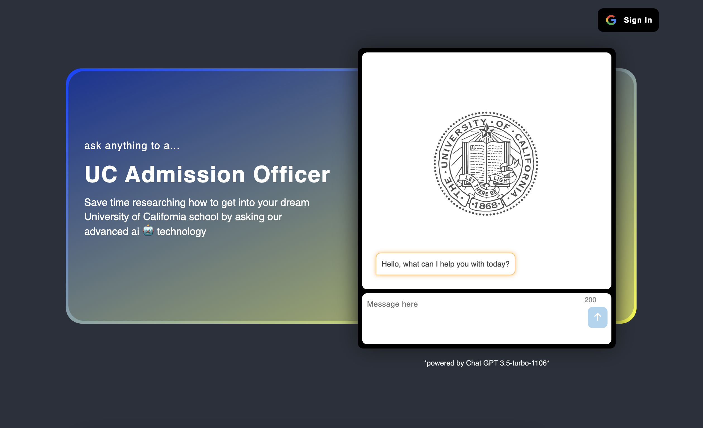
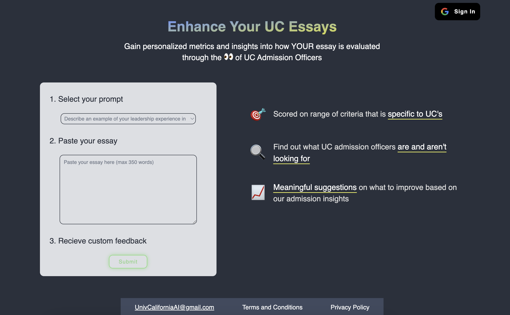
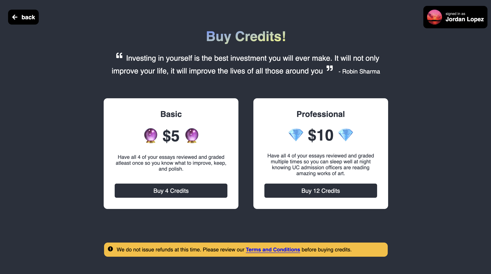

# UC Chatbot and Essay Reviewer

[explore the site here!](https://infinite-thicket-94821-c40c39ef6cfc.herokuapp.com/)

## Description

This app aids prospective University of California students in the application process. Using my GPT powered Admission Officer chatbot, students can gain valuable insights into how to properly complete the UC application as well as understand any and all questions a highly knowledgeable UC admission officer can answer. 
 
Along with the chatbot, I created an "UC application Essay Reviewer" which allows students to copy and paste their essays into our form and recieve a comprehensive evaluation with specific metrics. This allows any student understand what key things UC admission officers are looking for and provides valuable feedback that is exclusive to UC critera. 

## Usage

<h4>For the GPT powered chatbobt</h4>
Simply type directly into the chatbot form to begin asking questions!
 
<h4>For the Essay Reviewer</h4>
Sign in to your Google authorized account and follow the form directions *
 
<h5>* if you run out of credits, click the "buy more" link</h5>

## Technologies

- React
- JavaScript
- CSS
- Node.js
- Express.js
- MySQL (with Sequelize)
- Supabase (vector store)

## External Libraries

- Langchain.js (Toolkit to create chatbot technology)
- OpenAI (API to power the "Essay Reviewer" and functionality of chatbot)
- Stripe (integrated payment system)
- Google OAuth 2.0 (to allow users to sign in to their authorized Google Account)

## Questions
For questions about the project, you can reach me via:
- GitHub: [Lopez-Jordan](https://github.com/Lopez-Jordan)
- Email: jordanlopezemail@gmail.com
